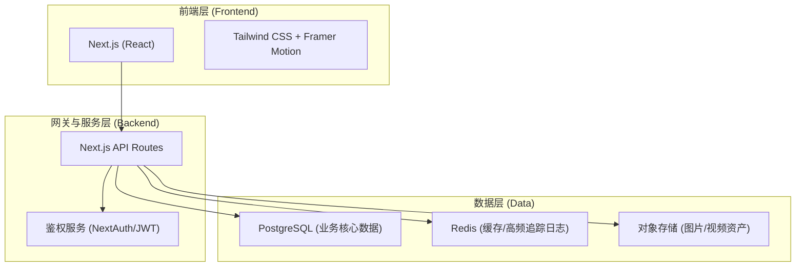
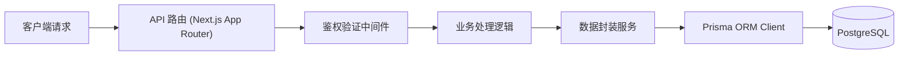
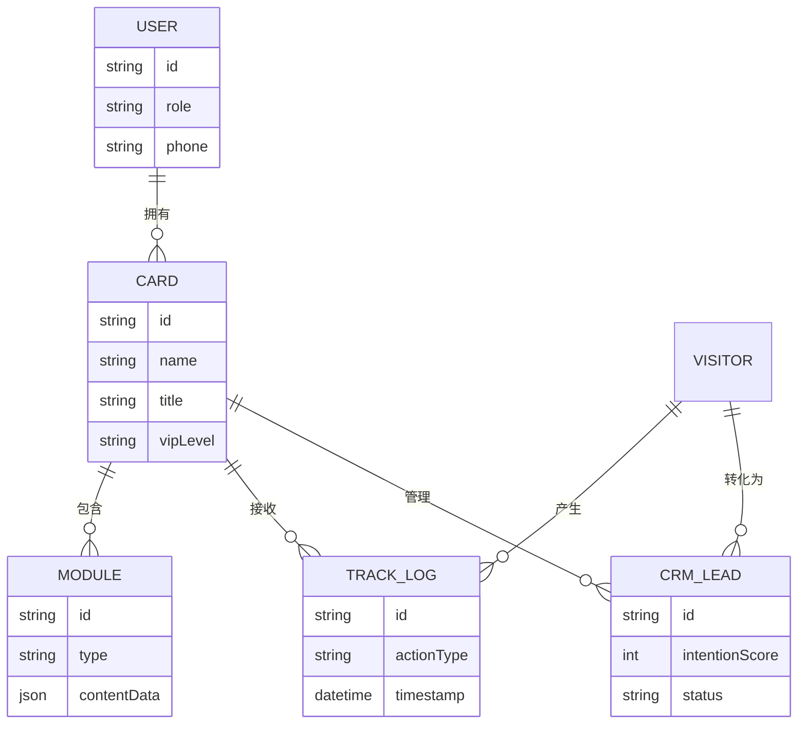

## 1. 架构设计


## 2. 技术说明
- **前端框架**：Next.js 14 (App Router) + React 18
- **样式方案**：Tailwind CSS (原子化CSS) + Framer Motion (平滑动画) + Lucide React (图标)
- **后端服务**：Next.js Route Handlers (全栈开发模式，便于快速迭代)
- **数据库与ORM**：PostgreSQL + Prisma ORM
- **状态管理**：Zustand (全局状态) + SWR/React Query (数据请求缓存)

## 3. 路由定义
| 路由 | 用途 |
|------|------|
| `/` | 智能名片主页 (访客端核心展示，SSR优化SEO) |
| `/posts` | 帖子主页 (论坛/人脉圈入口) |
| `/timelines/posts` | 正在关注的动态流 |
| `/nearby/posts` | 附近的帖子流 |
| `/admin` | 名片主管理后台 (工作台与数据看板) |
| `/admin/crm` | 客户线索与轨迹追踪管理 |

## 4. API定义
```typescript
// GET /api/card/[id] - 获取名片详情
export interface CardResponse {
  id: string;
  name: string;
  title: string;
  vipLevel: string;
  avatarUrl: string;
  companyAddress: string;
  modules: {
    type: 'audio' | 'video' | 'gallery' | 'blog';
    content: any;
  }[];
}

// POST /api/track - 行为追踪上报
export interface TrackPayload {
  cardId: string;
  actionType: 'view' | 'click' | 'stay';
  elementId: string;
  durationMs?: number;
}
```

## 5. 服务器架构图


## 6. 数据模型
### 6.1 数据模型定义


### 6.2 数据定义语言 (示意)
```sql
CREATE TABLE "User" (
    "id" TEXT NOT NULL,
    "role" TEXT NOT NULL DEFAULT 'VISITOR',
    "phone" TEXT,
    "createdAt" TIMESTAMP(3) NOT NULL DEFAULT CURRENT_TIMESTAMP,
    CONSTRAINT "User_pkey" PRIMARY KEY ("id")
);

CREATE TABLE "Card" (
    "id" TEXT NOT NULL,
    "userId" TEXT NOT NULL,
    "name" TEXT NOT NULL,
    "title" TEXT NOT NULL,
    "vipLevel" TEXT NOT NULL,
    CONSTRAINT "Card_pkey" PRIMARY KEY ("id")
);
```