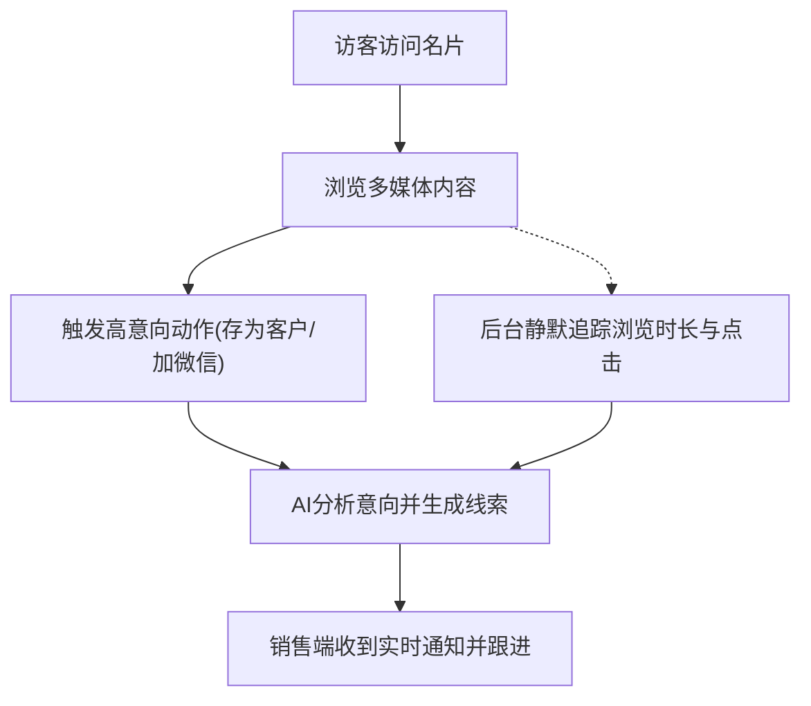

## 1. 产品概述
本项目旨在1:1复刻“智能名片综合平台”(mp.18xx.cn)，打造一个集个人展示、获客引流、智能营销和客户管理于一体的SaaS应用。
核心目标是通过丰富的多媒体展示和智能行为追踪，帮助销售和企业提升获客效率与转化率。主要服务于有高频商务社交需求的人群及B端企业。

## 2. 核心功能

### 2.1 用户角色
| 角色 | 注册方式 | 核心权限 |
|------|----------|----------|
| 访客 (C端) | 微信授权/手机号注册 | 浏览名片、查看音视频/相册/博客、交换名片、论坛互动 |
| 名片主/销售 (B端) | 企业开通/自主购买 | 配置个人名片、查看访客轨迹、管理CRM线索、发布动态 |
| 企业管理员 | 后台开通 | 管理企业名片模板、分配员工账号、查看全局数据看板 |

### 2.2 功能模块
1. **名片主页**：个人信息展示、快捷交互（存为客户/拨打电话/添加微信/名片海报/名片码）。
2. **多媒体展示区**：音频简介、图片展示（工作照/生活照等）、视频展示（经验分享等）、个人相册。
3. **内容专区**：个人博客（文章列表）、音乐榜单推荐（如网易热歌榜）。
4. **社交与引流**：人脉圈、帖子主页、正在关注、附近的帖子、动态。

### 2.3 页面详情
| 页面名称 | 模块名称 | 功能描述 |
|----------|----------|----------|
| 名片主页 | 顶部信息栏 | 展示头像、姓名、职位、VIP标识及快捷操作按钮群 |
| 名片主页 | 个人简介 | 文本及音频形式的自我介绍模块 |
| 名片主页 | 媒体矩阵 | 图片横向滑动、视频列表、相册网格展示、支持“更多”跳转 |
| 名片主页 | 博客专栏 | 个人文章列表展示（如：产品经理日常工作与挑战） |
| 社交页面 | 帖子/动态 | 论坛帖子列表（含主页、关注、附近等Tab切换） |

## 3. 核心流程
访客浏览与线索转化流程：

## 4. 用户界面设计
### 4.1 设计风格
- **主色调**：科技蓝或高端黑金（视VIP等级而定），搭配大面积留白，突出专业、商务感。
- **按钮风格**：微圆角（Rounded）、带轻微悬浮阴影，交互响应清晰。
- **字体与排版**：无衬线现代字体（如 Inter 或 苹方），层级分明，强调移动端的易读性。
- **布局风格**：卡片式布局（Card-based），模块间有清晰的视觉分割。
- **图标风格**：使用统一的线性或面性商务图标（如 Lucide Icons）。

### 4.2 页面设计概览
| 页面名称 | 模块名称 | UI元素设计 |
|----------|----------|------------|
| 名片主页 | 快捷操作区 | 紧凑排列的圆形或圆角矩形图标按钮，带点击态反馈 |
| 名片主页 | 媒体展示区 | 16:9 视频封面带居中播放Icon，1:1 正方形相册网格，横向滚动卡片 |
| 社交页面 | 导航栏 | 顶部吸顶Tab切换，带下划线平滑过渡动画 |

### 4.3 响应式设计
- 采用 **Mobile-First (移动端优先)** 策略设计，主要面向微信生态及手机浏览器。
- 桌面端访问时，主体内容居中定宽（模拟手机壳形态），两侧留白或展示企业品牌背景。
- 针对触摸屏优化点击热区大小（最小44x44px）。
